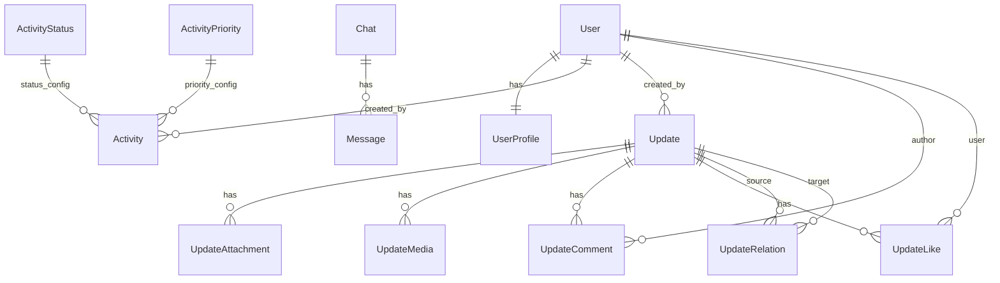

# RNexus Database Structure

This document describes the application data model: entities, fields, relationships, indexes, and integrity rules. It reflects the Django models in `backend/api/models.py` and is kept in sync with migrations under `backend/api/migrations/`.

## Overview

- Core domains: Users & Profiles, Activities, Chat & Messages, System Messages, Updates (news/feed) with Tags, Media, Comments, Likes.
- Backing DB: PostgreSQL in production, SQLite in tests/dev (see `core.settings_test`).
- Conventions: Most models have `created_at` and `updated_at`, sensible default orderings, and indexes for common queries.

## Entity Relationship Diagram



Note: `Chat.members` is a JSON array of user IDs (no join table yet). `Message` links to `Chat` by `chat_id` (string), not an FK.

## Entities and Fields

### Users
- User: Django’s built-in `auth_user` table is used (no custom user model enabled).

#### UserProfile (1:1 with User)
- user: OneToOne(User, on_delete=CASCADE, related_name="profile")
- middle_name, maternal_last_name, preferred_name
- position, department
- phone, phone_country_code (+1 default), phone_type (mobile|home|work|other), secondary_phone
- street_address, apartment_suite, city, state_province, zip_code, country
- bio
- education JSON[], work_history JSON[], profile_visibility JSON
- created_at, updated_at
- Meta: db_table="user_profiles"

### Activities
These capture operational events/tasks and reference presentational configs for status/priority.

#### ActivityStatus
- status (unique): planned|in-progress|completed|cancelled|overdue
- display_name
- color_bg, color_text, color_border (Tailwind classes)
- icon (emoji or short code)
- description, is_active
- sort_order (for display)
- Meta: ordering=[sort_order, status], verbose_name_plural="Activity Statuses"

#### ActivityPriority
- priority (unique): low|medium|high|critical
- display_name
- color_bg, color_text, color_border
- description, is_active
- sort_order (for display)
- Meta: ordering=[sort_order, priority], verbose_name_plural="Activity Priorities"

#### Activity
- id: UUID primary key
- title, description
- type: enum (Production, Maintenance, Inspection & Audit, Engineering, Logistics, Quality, Meetings, Projects, Training, Admin & Systems)
- status: enum value mirroring ActivityStatus.status
- priority: enum value mirroring ActivityPriority.priority
- status_config: FK(ActivityStatus, on_delete=PROTECT, related_name="activities")
- priority_config: FK(ActivityPriority, on_delete=PROTECT, related_name="activities")
- start_time, end_time
- assigned_to, assigned_by
- location (nullable)
- progress (0–100), estimated_duration (mins), actual_duration (mins, nullable)
- notes (optional)
- created_by: FK(User, on_delete=CASCADE, related_name="created_activities")
- created_at, updated_at
- Meta: ordering=[-created_at]
- Save behavior: when `status_config` or `priority_config` is missing, they’re auto-populated based on `status`/`priority` enum values.

### Chat & Messaging

#### Chat
- id: CharField primary key (db_index)
- chat_type: user|group
- name, description (for groups)
- user1: FK(User, null=True, related_name="chats_as_user1")
- user2: FK(User, null=True, related_name="chats_as_user2")
- members: JSON[] of user IDs (for groups)
- last_message: FK(Message, null=True, related_name="chat_last_message")
- last_activity: auto_now
- is_active: bool
- created_by: FK(User, null=True, related_name="created_chats")
- avatar_url
- created_at, updated_at
- Meta:
  - ordering=[-last_activity]
  - indexes:
    - (chat_type, last_activity)
    - (user1, user2)

#### Message
- chat_id (CharField, indexed), chat_type (user|group)
- sender_id (CharField), sender_name
- content (Text)
- message_type: text|image|audio|video|document|location|contact
- status: sending|sent|delivered|read
- reply_to: self-FK nullable, related_name="replies"
- forwarded (bool), forwarded_from (CharField)
- edited (bool), edited_at (DateTime)
- file fields: file_name, file_size, file_url, thumbnail_url, caption
- AV fields: duration (seconds), waveform JSON
- location fields: latitude, longitude, location_name
- contact fields: contact_name, contact_phone, contact_email
- timestamp (auto_now_add), updated_at
- Meta:
  - ordering=[timestamp]
  - indexes:
    - (chat_id, timestamp)
    - (sender_id, timestamp)
    - (status, timestamp)

### System Messages
#### SystemMessage
- recipient_id (CharField) — not a FK to allow system-wide and external lookups
- title (nullable), message (Text)
- message_type: info|warning|error|success
- link (URL, nullable)
- is_read (bool)
- created_at (auto_now_add)
- Meta: ordering=[-created_at]

### Updates (News/Feed)

#### Tag
- name (unique), description
- color (hex), category (optional)
- is_active (bool), usage_count (int)
- created_at, updated_at
- Meta:
  - ordering=[category, name]
  - indexes:
    - (category, is_active)
    - (is_active, usage_count)

#### Update
- id (CharField, PK)
- type: news|communication|alert
- title, summary, body
- timestamp (default now)
- status: new|read|urgent
- tags: JSON[] of strings
- author (display name)
- icon (emoji)
- created_by: FK(User, on_delete=CASCADE, related_name="created_updates")
- is_active (bool)
- priority (int, higher = more prominent)
- expires_at (nullable)
- created_at, updated_at
- Meta:
  - ordering=[-priority, -timestamp]
  - indexes:
    - (type, status)
    - (status, timestamp)
    - (created_by, timestamp)
    - (is_active, timestamp)

#### UpdateAttachment
- id (AutoField, PK)
- update: FK(Update, on_delete=CASCADE, related_name="attachments")
- type: pdf|doc|docx|txt|image|audio|video
- url, label
- file_size (bytes, nullable)
- created_at
- Meta: ordering=[created_at]

#### UpdateMedia
- id (AutoField, PK)
- update: FK(Update, on_delete=CASCADE, related_name="media")
- type: image|video|audio
- url, label, thumbnail_url
- duration (seconds, nullable), file_size (bytes, nullable)
- created_at
- Meta: ordering=[created_at]

#### UpdateRelation
- id (AutoField, PK)
- source_update: FK(Update, related_name="source_relations")
- target_update: FK(Update, related_name="target_relations")
- relation_type (default "related")
- created_at
- Meta:
  - unique_together: (source_update, target_update, relation_type)
  - ordering=[created_at]

#### UpdateLike
- id (AutoField, PK)
- update: FK(Update, related_name="likes")
- user: FK(User, related_name="update_likes")
- is_like (bool; True=like, False=dislike)
- created_at
- Meta:
  - unique_together: (update, user)
  - ordering=[-created_at]

#### UpdateComment
- id (AutoField, PK)
- update: FK(Update, related_name="comments")
- author: FK(User, related_name="update_comments")
- content (Text)
- parent_comment: self-FK (nullable) for threads
- is_active (bool)
- created_at, updated_at
- Meta:
  - ordering=[created_at]
  - indexes:
    - (update, created_at)
    - (parent_comment, created_at)

## Relationships (high level)
- User 1—1 UserProfile
- ActivityStatus 1—* Activity (via status_config)
- ActivityPriority 1—* Activity (via priority_config)
- User 1—* Activity (created_by)
- Chat 1—* Message (via chat_id string relationship)
- Update 1—* UpdateAttachment, UpdateMedia, UpdateComment, UpdateLike
- Update — Update (many-to-many through UpdateRelation with relation_type)
- User 1—* Update (created_by), 1—* UpdateComment, 1—* UpdateLike

## Integrity & Constraints
- PROTECT on Activity.status_config/priority_config prevents deletion of referenced configs.
- CASCADE on most content-to-parent relationships (e.g., Update → its attachments/media/comments/likes, Activity → created_by) cleans up dependents.
- Unique constraints:
  - UpdateRelation: (source_update, target_update, relation_type)
  - UpdateLike: (update, user)
- Enum fields constrained via choices; app logic ensures consistency between enum fields and their config FKs in Activity.save().

## Indexing & Query Patterns
- Chat:
  - (chat_type, last_activity) → listing recent chats per type.
  - (user1, user2) → fast lookup of direct (user-to-user) chats.
- Message:
  - (chat_id, timestamp) → fetch messages in a chat in order.
  - (sender_id, timestamp) → sender activity streams.
  - (status, timestamp) → delivery/read state dashboards.
- Update:
  - (type, status), (status, timestamp), (created_by, timestamp), (is_active, timestamp) → feeds and moderation tools.
- Tag:
  - (category, is_active), (is_active, usage_count) → filtering and popularity.
- Activities:
  - Default ordering by `-created_at`; consider composite indexes for common filters (status, priority, type) as usage grows.

## Migrations
- Location: `backend/api/migrations/`
- Current baseline includes:
  - `0001_initial.py`: core models
  - `0002_systemmessage.py`: adds `SystemMessage`

## Seed Data & Fixtures (detailed)
These management commands populate realistic sample data. Use the existing backend virtual environment.

- One-shot full seed (recommended):

```bash
backend/venv/bin/python backend/manage.py migrate
backend/venv/bin/python backend/manage.py populate_activity_configs
backend/venv/bin/python backend/manage.py populate_all
```

- Individual commands (order-aware):

```bash
# Ensure DB schema is up to date
backend/venv/bin/python backend/manage.py migrate

# Seed configs used by Activities UI colors and enums
backend/venv/bin/python backend/manage.py populate_activity_configs

# Foundation for Updates
backend/venv/bin/python backend/manage.py populate_tags

# Users (with profiles)
backend/venv/bin/python backend/manage.py populate_users

# Rich news/communications content
backend/venv/bin/python backend/manage.py populate_enhanced_updates

# Direct and group chats with messages
backend/venv/bin/python backend/manage.py populate_chats

# System notifications
backend/venv/bin/python backend/manage.py populate_system_messages

# Optional: legacy/basic updates
backend/venv/bin/python backend/manage.py populate_updates
```

- Re-seeding: Most commands are idempotent (update-or-create). If you need a clean slate, drop and recreate the DB or truncate tables before re-running.

## Testing Notes
- For CI and local tests, `core.settings_test` configures SQLite and minimal settings; migrations are applied automatically by Django test runner.

## Common queries and API mappings
Mappings between typical data access patterns and current REST endpoints.

### Auth & Profile
- Current user info: GET `/api/auth/user/` or `/api/user/info/`
- Login/Logout/Register: POST `/api/login/`, `/api/logout/`, `/api/register/`
- Profile view/update: GET `/api/user/profile/`, POST `/api/user/profile/update/`
- Change password: POST `/api/user/change-password/`

### Health & Meta
- Healthcheck: GET `/api/health/`
- Version: GET `/api/version/`

### Activities
- Legacy endpoints:
  - List: GET `/api/activities/`
  - Detail: GET `/api/activities/<activity_id>/`
  - Start/Pause: POST `/api/activities/<activity_id>/start/`, `/api/activities/<activity_id>/pause/`
- DRF v2 (preferred for new work):
  - List/Create: GET/POST `/api/v2/activities/`
  - Retrieve/Update/Delete: GET/PUT/PATCH/DELETE `/api/v2/activities/<id>/`
  - Actions: POST `/api/v2/activities/<id>/start/`, `/api/v2/activities/<id>/pause/`
- Query shape in DB: `Activity.objects.order_by('-created_at')`, commonly filtered by `status`, `priority`, and `type`.

### Chat & Messages
- Chats list: GET `/api/chat/`
- Chat messages: GET `/api/chat/<chat_id>/messages/`
- Update message status: POST `/api/message/<int:message_id>/status/`
- Delete message: POST `/api/message/<int:message_id>/` (delete)
- Search chats: GET `/api/chat/search/?q=...`
- Query shape in DB:
  - Chats: `Chat.objects.order_by('-last_activity')`
  - Messages: `Message.objects.filter(chat_id=...).order_by('timestamp')`

### Updates, Tags, Likes, Comments
- Updates:
  - List: GET `/api/updates/`
  - Detail: GET `/api/updates/<update_id>/`
  - Search: GET `/api/updates/search/?q=...`
  - Status change: POST `/api/updates/<update_id>/status/`
  - CRUD: POST `/api/updates/create/`, `/api/updates/<update_id>/edit/`, `/api/updates/<update_id>/delete/`
- Tags:
  - List: GET `/api/tags/`
  - Create: POST `/api/tags/create/`
  - Detail: GET `/api/tags/<int:tag_id>/`
- Likes:
  - Toggle like/dislike: POST `/api/updates/<update_id>/like/` (payload indicates like/dislike)
- Comments:
  - List for update: GET `/api/updates/<update_id>/comments/`
  - Create: POST `/api/updates/<update_id>/comments/create/`
  - Edit/Delete: POST `/api/comments/<int:comment_id>/edit/`, `/api/comments/<int:comment_id>/delete/`
- Query shape in DB:
  - Updates: `Update.objects.filter(is_active=True).order_by('-priority','-timestamp')`
  - Tags: `Tag.objects.filter(is_active=True).order_by('category','name')`
  - Comments: `UpdateComment.objects.filter(update=...).order_by('created_at')`

### System Messages
- Delivered internally and via WebSockets; not exposed as public REST endpoints yet.
- Query shape in DB: `SystemMessage.objects.order_by('-created_at')`

## Future Enhancements
- Normalize group chat members into a join table for better analytics and to support member attributes (roles, joined_at).
- Add composite indexes on Activity for frequent filters (status, priority, type) when query patterns stabilize.
- Add soft-delete flags on user-generated content where retention is required.
- Consider full-text search indexes on Update.title/body and Message.content.
